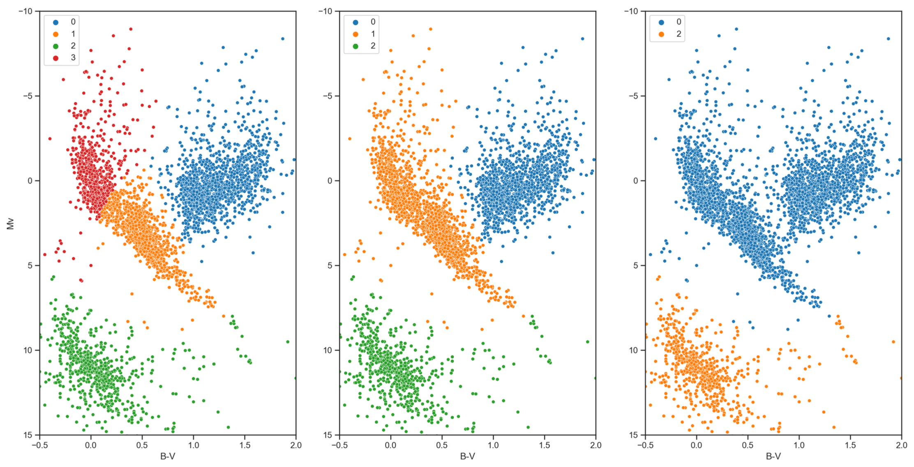
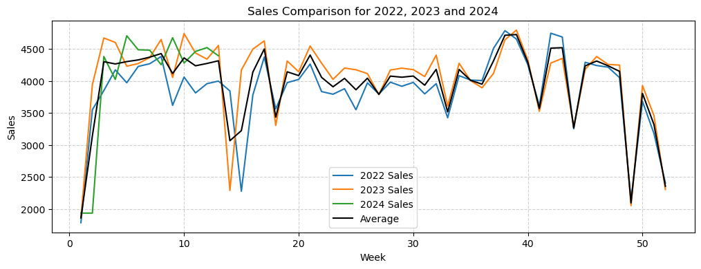
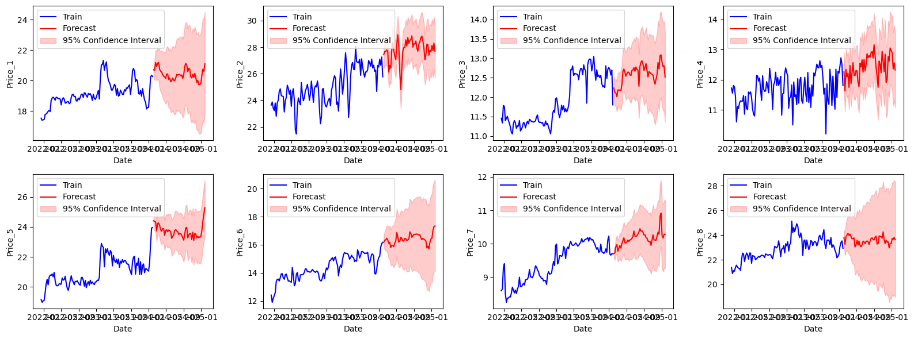
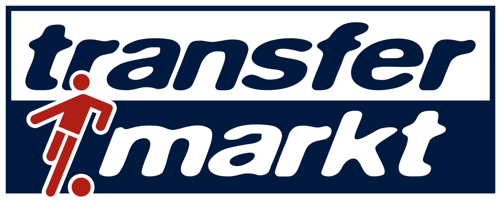
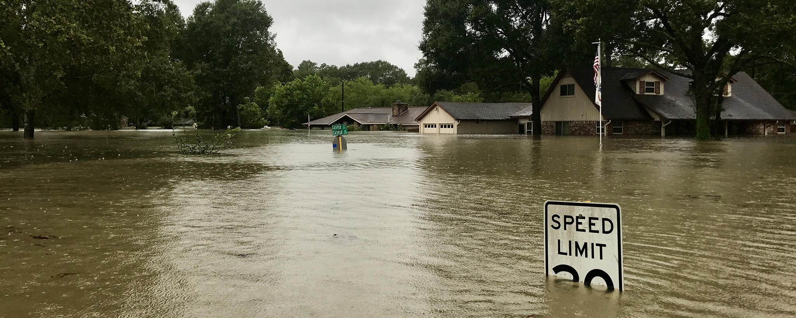

# Portfolio

Hello! In this portfolio, you can find descriptions of some of the projects I have carried out. They have been selected because they are concise projects that showcase different data science topics that I have covered over the years. 

In addition, I have also worked on projects involving technologies such as deep learning (neural networks, transformers), database management (SQL, MongoDB), cloud computing (Azure, AWS), big data processing (Hadoop, Spark), statistical analysis tools (R), version control (git) or BI tools (Power BI, Tableau).

---

## [Skin cancer detection with mixed data types](/skin_cancer_kaggle)
**2025 Kaggle Competition of AI Applied to Medicine at UC3M**

> This project addresses the **binary classification problem** of detecting skin cancer using the **ISIC dataset** from a private Kaggle competition. The goal was to get the best possible accuracy in classifying images and metadata into **cancerous** and **benign** lesions, despite the severe class imbalance in the dataset, using methods for both data types: from simple, tabular models to complex, pre-trained and fine-tuned CNNs.

[📄 Read More](/skin_cancer_kaggle)

---

## [When physics and machine learning help each other](/quantum_clustering)
**Probabilistic Quantum Clustering and its application to astrophysics and particle physics**

> For my **Physics Degree thesis**, I researched **Probabilistic Quantum clustering**, an unsupervised ML method that uses the Schrödinger's equation to perform effective and flexible clustering, and applied it to physics problems from **astrophysics** and **particle physics**.

[📄 Read More](/quantum_clustering)

---

## [Predicting weekly sales for a company](/sales_prediction)
**A Comparison of Classical ML Methods**

> In this project, the **weekly sales** for a company had to be predicted for half a year based on the data from the two previous years. The best possible combination of **preprocessing**, **feature engineering** and **ML model** had to be found for getting the best performance on a hidden test set; while also analyzing deeply how the features were related to the sales to extract key **insights**.

 

 

[📄 Read More](/sales_prediction)

---

## [Advanced time-series models for forecasting](/shares_time_series)
**Shares Values and Volumes Predictions**

> For this challenge, a dataset made of 32 **time-series** with weekly frequency had to be used for modelling the best possible **forecast** for the next whole year. With only 2 years for training and time-series with different behaviours and interactions between them, the 16 features relating the shares had to be predicted. For it, several **advanced models for forecasting** (ETS, SARIMAX, VARX, XGBoost...) were trained and tested to select the best.

[📄 Read More](/shares_time_series)

---

## [Data engineering with a complex database](/transfermarkt)
**A Demonstration of the Application of Big Data in Football**

> **Transfermarkt** is one of the most complete source of football data in the Internet, and it is constantly updated. In this project, **two problems** that use it were solved using simple but effective ML methods that allow not only **predicting**, but also extracting **conclusions**. For achieving that, **data engineering** with the several datasets was key for the final result.

 

[📄 Read More](/transfermarkt)

---

## [Aiding a city after a natural disaster](/optimization_aid)
**A Dive into Optimization Problems**

> In an assignment from my Master's Degree, we had to model and solve an **optimization problem** for assisting the population after a natural disaster. For my assignment, I created a semi-realistic version for helping the different **districts of Valencia** after a flooding where, with a **multi-parameter linear optimization model**, it could contribute to the **decision-making**.

[📄 Read More](/optimization_aid)

---

<small>Hosted on GitHub Pages &mdash; Theme by <a href="https://github.com/orderedlist">orderedlist</a></small>
