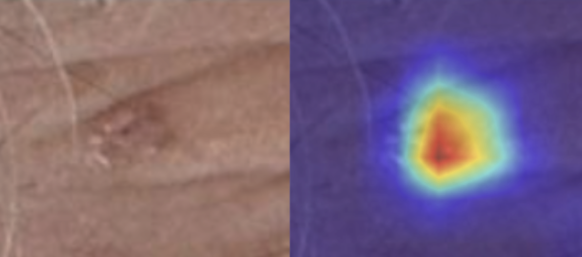

# Projects

---

## [Skin Cancer detection with mixed data types](/skin_cancer_kaggle)
**2025 Kaggle Competition of AI Applied to Medicine at UC3M**

> This project addresses the **binary classification problem** of detecting skin cancer using the **ISIC dataset** from a private Kaggle competition. The goal was to get the best possible accuracy in classifying images and metadata into **cancerous** and **benign** lesions, despite the severe class imbalance in the dataset, using methods for both data types: from simple, tabular models to complex, pre-trained and fine-tuned CNNs.

[📄 Read More](/skin_cancer_kaggle)

---

## [When physics and machine learning help each other](/quantum_clustering)
**Probabilistic Quantum Clustering and its application to astrophysics and particle physics**

> For my Physics Degree thesis, I researched and Probabilistic Quantum clustering, an unsupervised ML method that uses the Schrödinger's equation to perform effective and flexible clustering, and applied it to physics problems from astrophysics and particle physics.

[📄 Read More](/quantum_clustering)

---

## [Predicting Weekly Sales for a Company](/sales_prediction)
**A Comparison of Classical ML Methods**

> In this project, the weekly sales for a company had to be predicted for half a year based on the data from the two previous years. The best possible combination of preprocessing, feature engineering and ML model had to be found for getting the best performance on a hidden test set; while also analyzing deeply how the features were related to the sales to extract key insights.

[📄 Read More](/sales_prediction)

---

## [Advanced Time-series Models for Forecasting](/shares_time_series)
**Shares Values and Volumes Predictions**

> For this challenge, a dataset made of 32 time-series with weekly frequency had to be used for modelling the best possible forecast for the next whole year. With only 2 years for training and time-series with different behaviours and interactions between them, the 16 features relating the shares had to be predicted. For it, several advanced models for forecasting (ETS, SARIMAX, VARX, XGBoost...) were trained and tested to select the best.

[📄 Read More](/shares_time_series)
