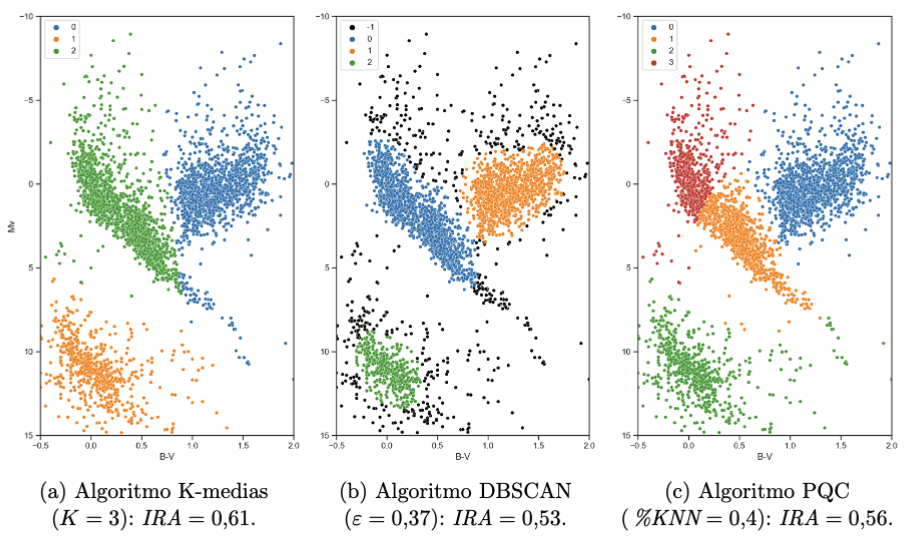
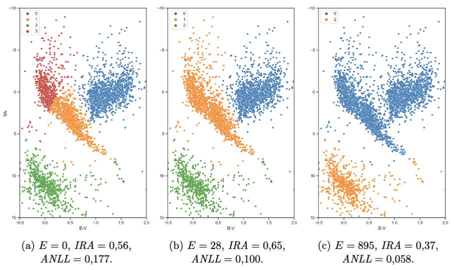
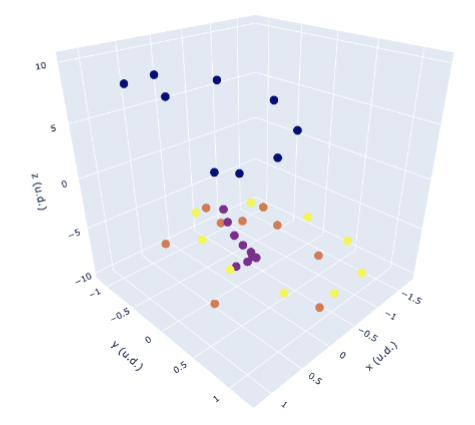
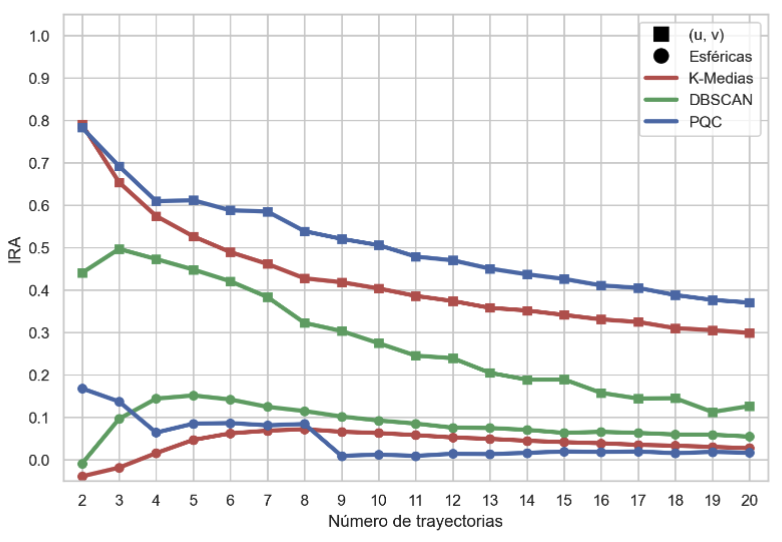

[🔙 Back to the portfolio](https://jorcamar.github.io)

# Probabilistic Quantum Clustering and its application to astrophysics and particle physics

> 📄 For a more detailed explanation of the theory, the algorithm, the data and the results; the full thesis is available [here](pdf/pqc_thesis.pdf). 

For my Physics Degree thesis, I worked with my tutor Prof. José D. Martín and with Dr. Raúl Casaña, the creator of the [PQC algorithm](https://arxiv.org/abs/1902.05578). This was a great opportunity to learn from them about a very interesting topic that involved two of my passions: physics and machine learning, and I am very thankful to them.

## Objectives of the work

  - Understand how the Schrödinger's equation can inspire a flexible and effective clustering algorithm.
  - Classify stars based on their features in an unsupervised way.
  - Separate particle tracks in collision simulations.

## PQC Algorithm (summary)

We start from the time-independent Schrödinger equation:

$$ H \Psi = \left[-\frac{\sigma^2}{2}\nabla^2 + V(\mathbf{x})\right] \Psi(\mathbf{x}) = E \Psi(\mathbf{x}) $$

where $H$ is the Hamiltonian, $E$ the energy, and $\sigma$ a length-scale parameter. From this, the potential can be written as:

$ V(\mathbf{x}) = E + \frac{\sigma^2}{2}\frac{\nabla^2 \Psi(\mathbf{x})}{\Psi(\mathbf{x})} $

Each observation is assigned a Gaussian wavefunction $\psi_i(\mathbf{x})$ with local covariance $\Sigma_i$ estimated from its $k$ nearest neighbors:

$ \Sigma_i = \frac{1}{N_k - 1} \sum_{j \in knn} (\mathbf{x}_j - \mathbf{x}_i)^T (\mathbf{x}_j - \mathbf{x}_i) $

The total wavefunction is then:

$ \Psi(\mathbf{x}) = \frac{1}{n}\sum_{i=1}^n \psi_i(\mathbf{x}) =
    \frac{1}{n}\sum_{i=1}^n \frac{1}{\sqrt{|2\pi\Sigma_i|}}
    e^{-\frac{1}{2}(\mathbf{x}-\mathbf{x}_i)^T \Sigma_i^{-1}(\mathbf{x}-\mathbf{x}_i)} $

To avoid singular or highly anisotropic covariances, eigenvalue regularization is applied:

$ \sigma^2_{th_i} = \frac{\sigma^2_{k'nn_i}}{p} $

with $p$ the dimensionality and $\sigma_{k'nn_i}$ the mean distance to $k'$ neighbors. The potential is computed by substituting $\sigma_i^2 \to \text{Tr}(\Sigma_i)$ and using the derivatives of $\psi_i$:

$ V(\mathbf{x}) = E + \left\langle \frac{\text{Tr}(\Sigma_i)}{2}\,
    \text{Tr}\left(\Sigma_i^{-1}(\mathbf{x}-\mathbf{x}_i)(\mathbf{x}-\mathbf{x}_i)^T\Sigma_i^{-1}\right)
    \right\rangle_\Psi -
    \left\langle \frac{1}{2}\text{Tr}(\Sigma_i)\text{Tr}(\Sigma_i^{-1}) \right\rangle_\Psi $

Finally, gradient descent on $V(\mathbf{x})$ finds local minima, and clusters are assigned via Bayesian probability.

Each point $\mathbf{x}_i$ evolves as:  

$ \mathbf{y}_i(t+\Delta t) = \mathbf{y}_i(t) - \eta(t) \nabla V(\mathbf{y}_i(t)) $

Adam optimization is used with convergence criteria:  

$ \max(|\Delta \mathbf{y}_i|) \leq \epsilon_y, \qquad \max(\Delta V(\mathbf{y}_i)) \leq \epsilon_V $

With a typical $\epsilon \approx 0.001$ used. From gradient descent, $K$ clusters are found. The wavefunction is split into $K$ subfunctions:  

$ \Psi(\mathbf{x}) = \sum_{k=1}^K P(k,\mathbf{x}), \quad P(k,\mathbf{x}) = \frac{1}{n}\sum_{i \in k} \psi_i(\mathbf{x}) $

With cluster probabilities:  

$ P(k) = \frac{\#k}{n} $

And conditional probabilities:  

$ P(k|\mathbf{x}) = \frac{\sum_{i \in k} \psi_i(\mathbf{x})}{\sum_{j=1}^K \sum_{i \in j} \psi_i(\mathbf{x})}, \qquad  
P(\mathbf{x}|k) = \frac{1}{\#k} \sum_{i \in k} \psi_i(\mathbf{x}) $

From that, the final group assignment is:  

$ \text{group}(\mathbf{x}) = \arg\max_k P(k|\mathbf{x}) $ 

Thus, clusters are defined by maximizing $P(k|\mathbf{x})$, with some groups possibly empty if never maximized.

---

## Star clustering

The first problem was used mainly to showcase the usefulness of PQC compared to other clustering algorithms, like K-means or DBSCAN, by applying the clustering to stars based on their features. By computing the Adjusted Rand Index with the star types, it was seen that the PQC gave the best results.

  

Not only this, but its hyerarchical structure (thanks to the $E$ threshold in the Schrödinger's potential) gave a measure of the similarity between the star types, with the main sequence stars being considerably more similar to the giant stars than the white dwarfs.

  

---

## Particle track detection

For showing the great performance of PQC with varying shapes of clusters, a particle track detection problem was tried. In this problem, the performance of K-means, DBSCAN and PQC was compared for clustering the track points of particle collisions using both spherical and a pair of custom coordinates. This is an example of 4 particle tracks in cartesian coordinates:

  

By comparing the Adjusted Rand Index for these methods for several number of tracks, it could be seen that the approach that involved creating a custom set of coordinates + PQC was clearly the best:

  

---

## 💬 Conclusions

In this work, we tested the usefulness of physics in the creation of machine learning algorithms by studying probabilistic quantum clustering (PQC). At the same time, we
applied this and two other clustering algorithms (K-means and DBSCAN) to two physical problems, obtaining satisfactory results.

These two physical problems benefited from clustering because of two main characteristics: they were problems that involve a large number of data (making the use of computer science necessary) and whose objective is to classify the observations into different groups. Therefore, it is interesting to face those physics problems that share these characteristics with machine learning algorithms.

The star diagram problem allowed us to visualize the functionalities of probabilistic quantum clustering with a simple and popular problem in physics, seeing how it not only gives good results, but also provides us with deeper information about the hierarchical structure of the groups. These characteristics and its high flexibility make it useful for the study of complex datasets.

Furthermore, in the two problems we compared the performance of PQC with the K-means and DBSCAN algorithms, with the performance of PQC being superior in both. This physics-inspired algorithm is not only functional and provides useful tools, but also has high performance, which motivates its use in both physical and non-physical problems. 
