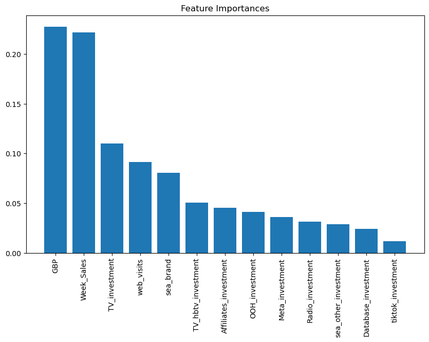

[🔙 Back to the portfolio](https://jorcamar.github.io)

# Predicting Weekly Sales for a Company

> ‼️ This is just a summary for the project. **For reading the full steps, code and explanation, please [go to the Jupyter Notebook 📙.](notebooks/sales-prediction.html)**

## 📖 Project Description
The main **objective** of this project was to predict the `Sales` numeric label for a hidden test set, with a dataset that had weekly instances. For it, we restrained ourselves to **"classical" Machine Learning methods** due to the lack of training data (not neural networks, although a simple one was tested). For achieving this, we defined two secondary objectives:

- **Preprocessing**: find the best preprocessing of the data (EDA, understand the relationships between the features, do feature engineering that improves the performance).
- **Best model**: with an adequate train-validation split, find the best model and do the predictions for the hidden test set.

Furthermore, a key part of the project was the **insights**, that helped us understand which features were the most related to the **sales** and how, so it could help in making future decisions.

In the [notebook]((notebooks/sales-prediction.html)), every step of the work is detailed. After the setup, an **Exploratory Data Analysis** was performed to fully understand the dataset and the relationships between features. With that information, the **preprocessing** of the data was done, doing key feature engineering for the performance of the future models. Before the creation of the models, more **dataset insights** were extracted thanks to a statistical analysis and the **evaluation method** for selecting the best model was explained. Finally, all the **models** were trained and evaluated, extracting information about the data with each one of them, and the **final predictions** and **conclusions** were detailed.

In this page, some key aspects of the work are summarized.

---

## ⚙️ Preprocessing

One of the key aspects of the project was to create new features that improved the performance of the models, capturing information that was not in the original dataset. By plotting the data yearly:

  

It was seen that there was evident **seasonality**. Time-series methods were not covered in this project (they are used in another project), so a new feature was created to take into account seasonality for the ML methods used: `Week_Sales`, which has the average of sales for that week in other years (using Leave-One-Out regularization for avoiding data leakage). This feature (with a considerable correlation with the `Sales` target, as seen in the next figure) turned out to be one of the key factors for the weekly sales prediction.

  

---

## 📈 Statistical Analysis

The statistical analysis gave useful insights before the training of the models. 

A simple **correlation analysis** showed us how the different inversions in investments help with sales, with the most valuable being the ones related to TV (classic TV and hybrid TV). Investment in some online platforms like Meta (Facebook) or search engine advertising (SEA) were also correlated. Then, we had the rest of the investments, that show a low but non-zero correlation. This simple tool could be very useful for knowing how to invest in the future for the business. **ANOVA** and **Mutual information regression** also showed relevant relationships between the predictors and the target, which were useful for our insights and for the training of the models.

---

## 📊 Models results

Simple models also gave information about how features affected the weekly sales. With more complex models, this interpretability started to decrease, but it allowed for very good predictions. The final results, based on MAE (metric specified by the challenge) can be seen in this figure:

  

Best model: **Gradient Boosting**

---

## 💬 Conclusions

From `GradientBoostingRegressor` (the best model), feature importances were extracted, which are computed based on the total reduction of impurity (in our case, Friedman MSE, as this method only allows this criterion and MSE):

  

The order of importance was similar to what we saw until then, with `TV_invesment` (not `TV_hbtv_investment`) being the most relevant investment feature. However, it was interesting that the most important feature for this final model was nor `Week_Sales` as in the previous ones (although it was very near): it was `GBP`. As this feature is related to some money quantity (for example, some investment), it is very relevant for the business that `Sales` depended quite a lot on it.

The rest of the predictors were also used by the model, only that in a smaller degree. Other interesing non-investment predictors were `web_visits` and `sea_brand`, which were quite useful for the model.

For getting more information, apart from the feature importances, `PartialDependenceDisplay` from sklearn was used to see the partial dependences for all the predictors, ordered by feature importance:

  

It can be seen the form of the positive relationships between `Sales` and the non-invesment predictors `GBP`, `Week_Sales` and `web_visits`; and the more relevant investment predictors `TV_investment`, `TV_hbtv_investment` and `Affiliates_investment`. The other relationships were not as clearly positively-related and simple as that, showing how investment in these fields may not impact directly the number of `Sales`.

This were the **final conclusions** about the features affecting the weekly sales, which would correspond to the insights needed by the company:

- **Investment-related variables**: we have seen how some of the most relevant predictors were related to investment. However, their relevance was quite different between them, so we can order them by importance:
  
  1. **Investment on TV**: all the tools used revealed that the most important investment predictors were those related with TV: `TV_investment` and `TV_hbtv_investment`. The business should allocate most of its investments on them.

  2. **Other relevant investments**: `Affiliates_invesment` and `Database_investment` showed relevance also during the tests and the models. Although not as important as investment on TV, the business should not stop investing on these fields.
  
  3. **Less relevant investments**: the other investments showed some importance, but it was clearly smaller that the importance for the variables in points 1 and 2. Also, interaction between them did not appear to be relevant, so if the business needs to reduce its total investment, it should start cutting in these fields.

- **Non investment-related variables**: although we were focusing on investment variables, other predictors have shown its importance for predicting sales, which gives the business information about the market:
  
  1. **Seasonality**: as we knew the date of the week for each number of sales during more than two years, we created the variable `Week_Sales` for taking into account seasonality. It turned out to be quite relevant, as sales during a week can be predicted partially if we know the data from other years.

  2. **Relevant variables**: `GBP`, `web_visits` and `sea_brand` have been significant during most of the models, so the business can gain more insights with these relationships.

