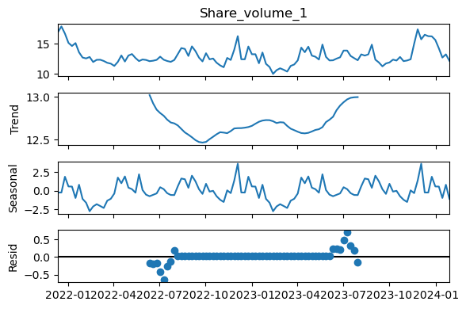
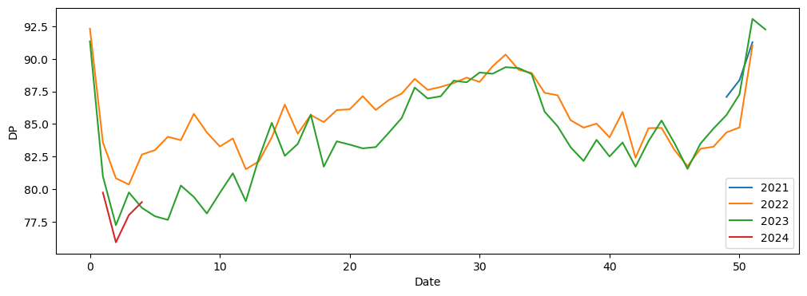
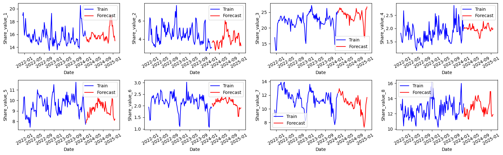
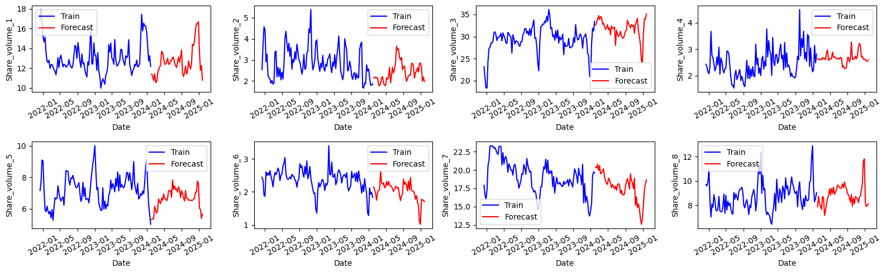

[🔙 Back to the portfolio](https://jorcamar.github.io)

# Advanced Time-series Models for Forecasting

> ‼️ This is just a summary for the project. **For reading the full steps, code and explanation, please [go to the Jupyter Notebook 📙.](notebooks/shares-time-series-prediction.html)**

> 📉 For a project covering several "classical" ML models, you can visit [this page](/sales_prediction).

## 📖 Project Description

In this challenge, we had a dataset made of 32 time-series with weekly frequency: `Share_value`, `Share_volume`, `Price` and `DP`; for 8 different brands. The objective was to analyze and forecast the `Share_value` and `Share_volume` for 8 brands on a weekly basis for the next year (52 weeks), and do the best possible prediction (evaluated with the MAE).

For doing it, an in-depth analysis was performed with an exploratory analysis of the data to understand it, several advanced forecasting models were tested and the best one was selected for doing the final predictions of 52 weeks. 

This page is just a summary of some insights into the project. A detailed description of the reasoning behind the steps and the code is in the corresponding notebook that you can see [here](notebooks/shares-time-series-prediction.html).

---

## 🔎 Exploratory Data Analysis

The EDA revealed several important information about the data, which was key for guiding the development of the models.

Firsly, since the available data spanned just over 2 years (which is a short time, taking into account that a whole year had to be predicted), seasonality was looked for, as it could be quite helpful. By doing a seasonal decomposition:

  

It was seen that a clear yearly seasonality was present (in this case, it is plotted in the "trend" subplot), as can be seen also by plotting the data per year:

  

This allowed the prediction to be more solid, as the 52 week forecast could be more precise by taking into account this seasonality. Furthermore, a statistical analysis gave these key insights into the features:

- The share value of a brand was highly correlated with the share volume. This means that, with forecasting one of them, the other could be easily predicted. During the models, this will be used.
- There was high correlation in the DP and Price features.
- The targets for a brand were not necessarily correlated only with the predictors of that brand, so an individual analysis per brand was probably not the optimal approach.

Moreover, stationarity and autocorrelations were checked for all the features, with the corresponding consequences in the model designs.

---

## ⚙️ Feature Engineering

A key step in the work was the introduction of new features that improved the performances of the predictions, as they were correlated with the targets. The most important one was simple: the value of the target features a year (52 weeks) before. This allowed general ML models, like XGBoost, to accurately model the seasonality of the data.

---

## 📊 Models Tested

Several models were tested, from simple models that gave information about which predictors were useful, to more complex models, with better forecasting capabilities:

- Naive median: for computing the MAE and using it as a baseline error.
- Automatic models:
  - ETS (Error, Trend, Seasonality): captures trend and seasonality components explicitly.
  - SARIMA: handles both autocorrelation and seasonality.
- Models for exogenous variables:
  - SARIMAX: extends SARIMA by incorporating external predictors (`Price` and `DP`).
- Multi-variate models:
  - VAR: captures interdependencies between multiple time-series (like the influences between the economic indicators of the dataset).
  - VARX: strong for multi-series forecasting where both internal dynamics and external drivers matter.
- "Classical" ML models:
  - RandomForest: robust and can provide feature importances.
  - XGBoost: often achieves state-of-the-art performance in tabular prediction tasks, including time-series regression.

---

## 🏆 Best Models

By getting the performance evaluation of each model in a validation test, the best model was selected for each of the 16 targets. Although ETS worked the best for some of the features (5), most of them (11) had the best predictions with XGBoost. Moreover, the best performance for XGBoost was found when the `Share_value` features were predicted first and then used for the forecast of `Share_volume`, which was a key step for getting the best possible performance.

--- 

## 💬 Conclusions

In this project, a complex time-series dataset was analyzed. It was checked how the relationships between brands, predictors and targets was not trivial at all (except for the high correlation between the share value and volume for a certain brand). However, thanks to the dynamic regression models, it was seen which were the significant predictors for each target and that was used for the final models, although there were some targets that did not have significant predictors and were best forecasted with an ETS model instead of the XGBoost model, which showed to be the best non-automatic model.

Forecasting the DP and Price predictors with ETS and using them for other models showed to give better results than forecasting the targets directly with ETS for most of the targets, showing how these predictors were probably easier to predict and the more complex ML models could get this ETS information and "mix it" with other useful predictors. However, these methods did not give us options to compute the confidence intervals from the ETS models.

Finally, it was seen that the forecast achieved to grasp the seasonality for each target, predicting well those clear peaks and valleys that appear in the same months and the nature of the values:

  

  

