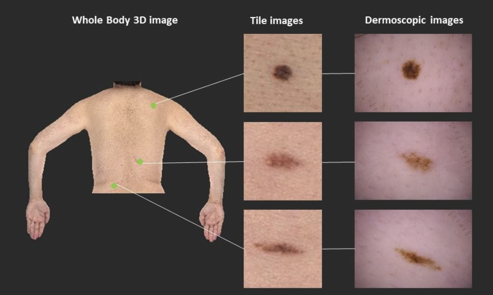
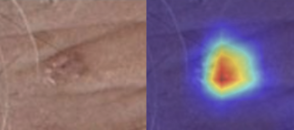

[🔙 Back to the portfolio](https://jorcamar.github.io/#skin-cancer-detection-with-mixed-data-types)

# ISIC Kaggle Competition

> 📂 [Go to the GitHub repository for the project](https://github.com/jorcamar/isic-dataset-kaggle-competition/)

## 📖 Project Description
This project addresses the **binary classification problem** of detecting skin cancer using the **ISIC dataset** from a private Kaggle competition. The goal was to accurately classify images and metadata into **cancerous (positive)** and **benign (negative)** lesions, despite the severe class imbalance in the dataset.

  

**Motivation:** Early detection of skin cancer can save lives, and machine learning can help automate this process for faster, more reliable screening. With an advanced method, images of lower quality (like those taken by the pacients with their phones) could be useful for diagnosis.

---

## 📊 Dataset
- **Source:** ISIC Dataset on Kaggle (private, UC3M competition)
- **Size:** 400,959 instances (400,616 negative, 343 positive)  
- **Data Types:**  
  - Images of skin lesions  
  - Metadata with 35 numerical and 10 categorical features  

**Challenges:**  
- Extremely imbalanced classes (0:1 ratio ≈ 1165:1), mirroring the real-life scenario.
- Several metadata features with overlapping or non-predictive information.
- Two types of data: images and tabular data (metadata).

As there were two types of data, the approach followed was to look for the best model for images and the best model for metadata. Then, the best way to combine them was studied.

---

## 🛠 Methodology

### Data Preprocessing

Each data type needed its own preprocessing.

- For image models:
  - Resizing and normalization to match pre-trained CNN input requirements.
  - Data augmentation: random flips, rotations (±20°), resizes, and crops.

This improved considerably the performance of the CNNs, and was used throughout all the image models.

- For metadata models:
  - Dropped non-predictive features (by performing statistical analysis).
  - Standard scaling for numerical features.
  - One-hot encoding for categorical features.
  - Preprocessing implemented in a scikit-learn pipeline to avoid data leakage.

These were standard steps for selecting those features that could have predictive value.

### **Handling Class Imbalance**

Different approaches were tested, with these giving the best performance:

- For image models:
  - Weighted Random Sampler (WRS) with 1000 instances per epoch. This was found to be the best option for handling the high amount of data, and to give the same importance in the training to each class.

- For metadata models:
  - Training set balanced with "just" 10x more negative instances than positives (downsampling).
  - Use of class weights in RF and XGBoost.

### Models Evaluated

These were the main models that were tested:

**Image Models:**
- CNN from scratch: simple CNN designed and trained from scratch with the training set.
- Pre-trained CNNs + fine-tuning: ResNet50, VGG16, EfficientNet, DenseNet. While freezing certain layers during the fine-tuning was tested, not freezing any layers constantly gave the best performance.

**Metadata Models:**
- Random Forest
- XGBoost
- Neural Networks: a simple, fully-connected NN.

For hyper-parameter optimization: Repeated stratified 5-fold cross-validation.

**Model Combination:** This were the models that combined the submissions from image and metadata models.
- Averaging predicted probabilities.
- Selecting the prediction with **highest confidence** (furthest from 0.5) for each instance.

A NN that combined the CNN for images and the NN for tabular data was tried, but due to the few positive instances, it did not have a good enough performance.

---

## 📊 Results

- Best Image Model: ResNet50 (fine-tuning the entire network)
- Best Metadata Models: Random Forest & XGBoost

The best validation accuracy was obtained when combining these 3 best models by selecting the prediction with **highest confidence**, with a final hidden test accuracy in the challenge of 0.97. With a class distribution of 1:1 in the test set, this accuracy is clearly above the trivial one.

---

## 💬 Conclusions

For understanding where the best image model was focusing on, we can take a look at a positive sample and its GradCAM. It could learn to focus on the spot in the skin and its limits, which is what is the most helpful tool to learn about the dangerousness of it.

  

In metadata models, there were no features with a very high correlation with the target: instead, almost all of them were slightly correlated, showing that a well-tuned complex model was able to get very information from them.

For many instances in the test set, there was a model with clearly the highest confidence: sometimes the image model was able to clearly predict the correct class, while other times the metadata model gave the probability with highest confidence. This showed how both types of data are very relevant to the prediction and, with more data, models that learn to combine them better (like a NN made from CNN for image + FCNN for metadata) could allow for even better predictions.

Although the challenge used accuracy as a metric, using a metric that prioritizes the recall (due to the nature of the problem) together with human analysis could be of great help for doctors to diagnose this type of cancer.
